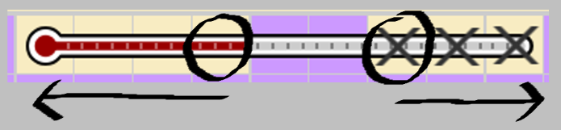
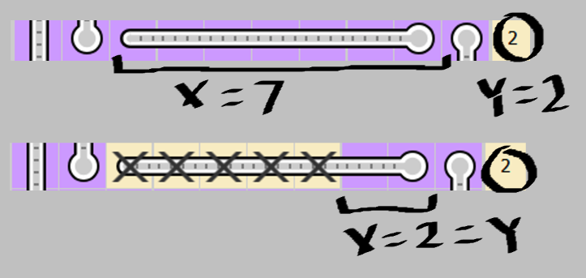
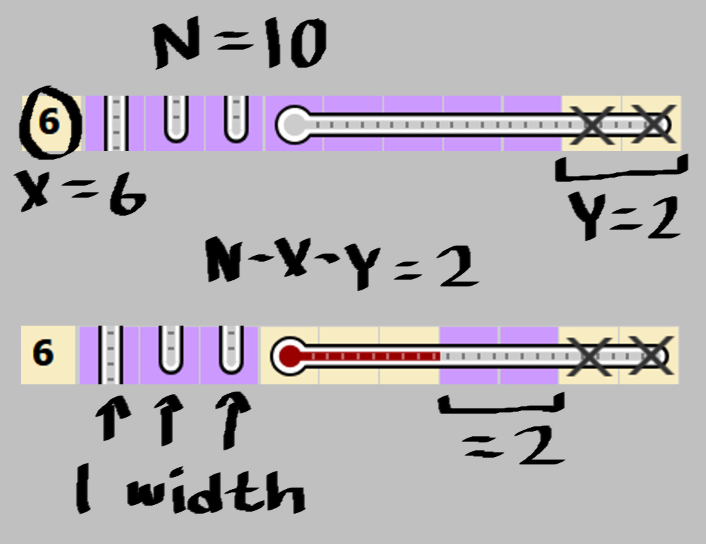
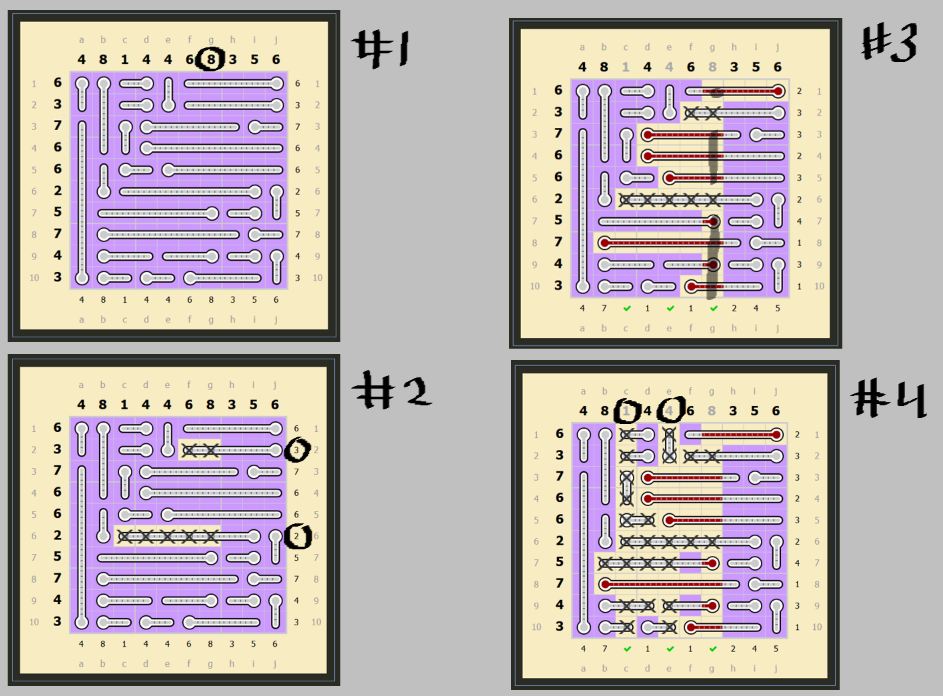
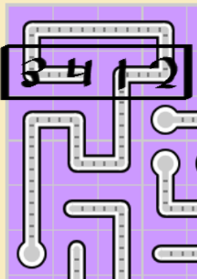

Thermometers
============

Rules
-----

(sourced from `puzzle-thermometers.com <https://www.puzzle-thermometers.com>`_)

* You have to fill some thermometers with mercury starting from the bulb and going toward the end without gaps.
* The numbers outside the grid show the number of filled cells horizontally and vertically. 

Options
-------

* "Highlight errors"
* "Auto flood mercury and air"
* "Highlight completed"
* "Show counters" + "Count remaining"
* Setting a different background color also helps.

Introduction
------------

Thermometers is similar to Aquarium through the ability to autofill large areas, except here the areas being filled are linear, and can always be partially filled. One of the most important things to note is that when you click on a cell in a thermometer, mercury is flooded towards the bulb, while air (cells with an x) is flooded away from it.

This puzzle is also much harder to make local deductions on due to the nature of many moves to bring attention to other parts of the board, so solving these is much more centered around completing the biggest rows/columns first, and working your way down from there. Since there also aren't any difficulty separations between sizes, solve times can vary more, but the raw difficulty of the puzzle is consistent across all sizes.

Counting
--------

Counting with air is pretty simple; if a thermometer has a number ``X`` amount of empty cells left, and there is ``Y`` remaining mercury in the row/column the thermometer occupies, then place air starting at the end until ``X`` is equal to ``Y``. Make sure you're looking at the remaining counter instead of the total number here, since that's what gives ``Y`` directly.

Counting with mercury is slightly trickier; in a puzzle of size ``N``x``N``, with a row/column having a total of ``X`` mercury and currently containing ``Y`` air cells, then each thermometer in that row/column can be filled with mercury until there are ``N - X - Y`` empty cells left in that thermometer. If a thermometer's width is less than or equal to this number, then it is not big enough to fill.

Also, empty cells here are cells without mercury or air, so make sure you aren't counting air as an empty space. The main distinction is that while empty cells are still part of the thermometer they belong to, air effectively reduces the size of the thermometer it is in. Thermometers that intersect a row/column are also treated as having a length of 1 cell here, and are only relevant if all the mercury or air in a row/column is filled.

Handling Big Rows/Columns
-------------------------

This is typically how you start a puzzle when speedsolving, and is especially useful on 10x10 or 15x15 boards. Look for rows/columns with a total close to the size of the board (for example, 8 or 9 on a 10x10), and then look at all the thermometers that intersect that row/column. Most of the time, there will be cells in those thermometers you can fill with air to limit the big row/column, and then once there is enough air, you can fill that entire big row/column with mercury. This often solves a significant part of the board, and from here you can go through any completed rows/columns and click on their grayed out numbers to fill a lot of air.

Curved Puzzles
--------------

Curved variants have the same approaches as normal puzzles, but the strategies here are slightly harder to apply. While the thermometers are still flooded in the same linear fashion, the path they take can branch out into other rows/columns, or go in and out of the row/column they start in. With air or mercury counting, make sure you identify the order of the cells in a thermometer, since the paths here aren't immediately obvious. Big rows/columns are handled the same, but intersecting thermometers can give that big row/column more than one air cell at once. On that note, keep in mind that intersecting thermometers are able to take up more than one space in a given row/column, so they can be handled as distinct thermometers in counting strategies.

Even though the deductions on curved puzzles are harder to see, they can also be more powerful, since the thermometers can occupy more different rows/columns, and their sizes aren't as restricted, with at least a couple usually taking long paths.

Speedsolving Approaches
-----------------------

*(all approaches are relevant for normal and curved puzzles of those sizes)*

**4x4:** These are very simple, and you can usually start out by filling mercury in rows/columns with 3 mercury, and optionally filling air in rows/columns with 1 mercury. With enough practice, you can play these without having to place air, and instead using the grayed out numbers to determine where to place mercury. Placing air is never required for any thermometers puzzle, and even though it's usually necessary to figure out deductions on larger puzzles, it always takes time up to place air. There's also a couple one click solution puzzles on 4x4-curved, and you can get a cheesed single fairly quickly by loading new puzzles and clicking the top left corner until you get that puzzle.

**6x6:** These are slightly more involved than 4x4 puzzles, and while big row/column handling isn't too useful, counting is much more relevant. As a general rule, always prioritize counting mercury, since while air only fills one thermometer, mercury can lead to completions of entire rows/columns. Then again, if you spot an air counting deduction, go ahead and place it. There exists a one click solution on 6x6-curved by clicking the bottom right corner, but cheesing this takes much longer than 4x4-curved.

**10x10:** There are three primary stages for solving these puzzles. The first is big row/column handling, which can add a ton of information to the board; however, some puzzles aren't as nice about finding these moves as others. The second is counting, which involves scanning the remaining rows/columns for those decutions; this part usually takes the longest, and practice is necessary if you want to get out of this stage as quickly as possible. The last is filling the rest of the small empty cells; even though it still requires looking around the whole board, it doesn't take as much effort to finish the puzzle from here.

**15x15:** These have the same general approach as 10x10 puzzles, but require some more endurance to get past. Still, with practice, you can reliably solve these in a couple minutes. Same goes for any of the special puzzles; the three stages continue scaling up from here, and take more time to finish.